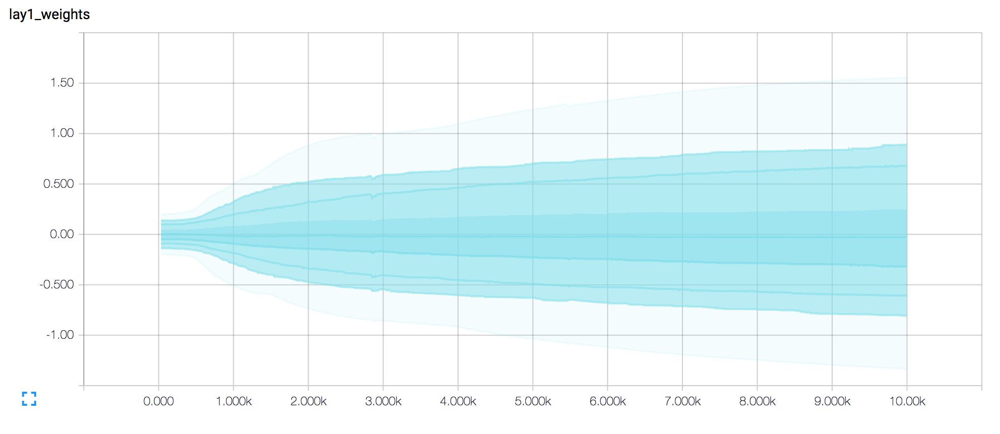
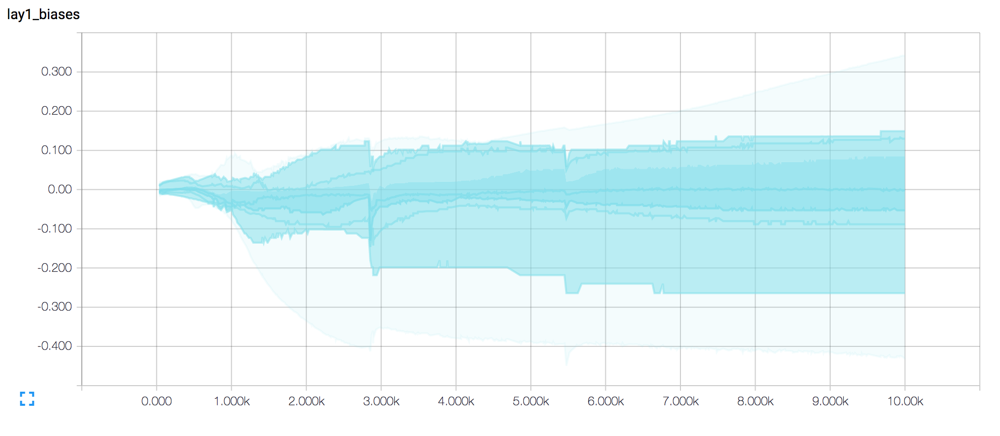
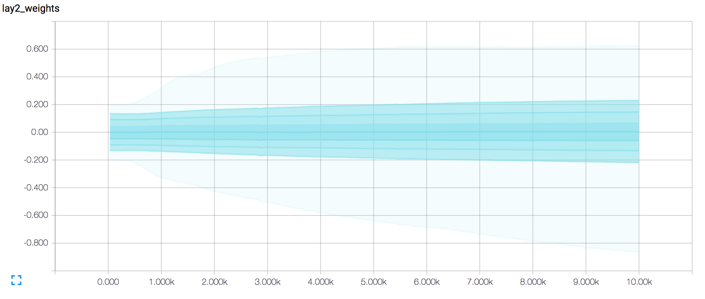
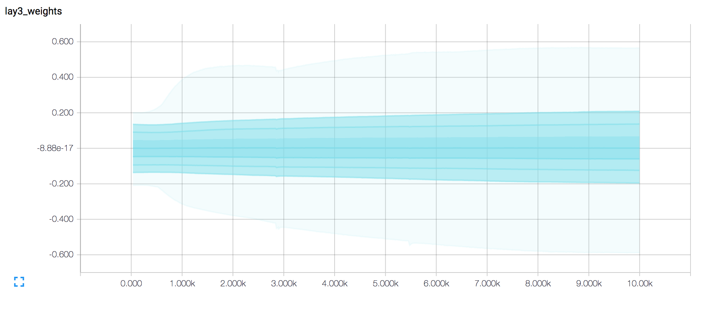
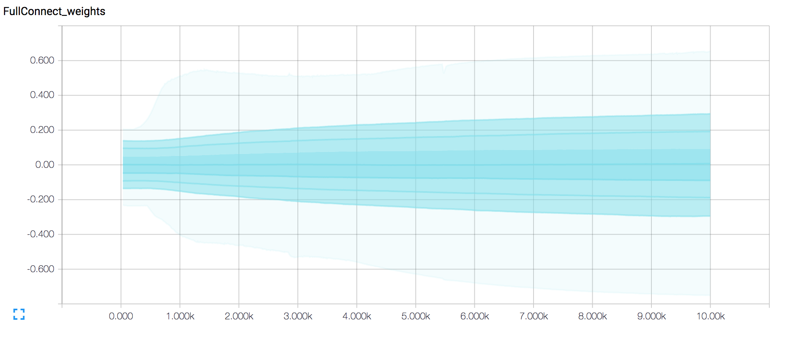

```python
from __future__ import print_function
import numpy as np
import tensorflow as tf
from six.moves import cPickle as pickle
from six.moves import range
import glob
import csv
import pandas as pd 
from skimage.io import imread
import numpy as np
```


```python
def read_data(typeData, labelsInfo, imageSize, path):
 #Intialize x  matrix
 x = np.zeros((labelsInfo.shape[0], imageSize))

 for (index, idImage) in enumerate(labelsInfo["ID"]):
  #Read image file
  nameFile = "{0}/{1}Resized21/{2}.Bmp".format(path, typeData, idImage)
  img = imread(nameFile, as_grey=True)

  x[index, :] = np.reshape(img, (1, imageSize))
 return x

imageSize = 441 # 21 x 21 pixels

#Set location of data files , folders
path = '../../'

labelsInfoTrain = pd.read_csv("{0}/trainLabels.csv".format(path))  #this is a pandas DataFrame

pathTrain = '../../trainResized21/'
#Read training matrix
xTrain = read_data("train", labelsInfoTrain, imageSize, path)

pathTrain = '../../'
#Read information about test data ( IDs ).
labelsInfoTest = pd.read_csv("{0}/sampleSubmission.csv".format(pathTrain))

pathTest = '../../testResized21/'
#Read test matrix
xTest = read_data("test", labelsInfoTest, imageSize, path)


print('Train labels ID ', labelsInfoTrain["ID"].values)
print('xTrain shape: ', xTrain.shape)  # train set has 6283 21X21 pixel images
print('Train labels shape: ', labelsInfoTrain.shape)
print('First 5 labels: \n' , labelsInfoTrain[0:5])
print('xTest shape: ', xTest.shape)    # test set has 6220 21X21 pixel images
print('Classes: ', np.unique(labelsInfoTrain['Class'].values))     # 62 classes
uniqueLabels = np.unique(labelsInfoTrain['Class'].values)

```

    Train labels ID  [   1    2    3 ..., 6281 6282 6283]
    xTrain shape:  (6283, 441)
    Train labels shape:  (6283, 2)
    First 5 labels: 
        ID Class
    0   1     n
    1   2     8
    2   3     T
    3   4     I
    4   5     R
    xTest shape:  (6220, 441)
    Classes:  ['0' '1' '2' '3' '4' '5' '6' '7' '8' '9' 'A' 'B' 'C' 'D' 'E' 'F' 'G' 'H'
     'I' 'J' 'K' 'L' 'M' 'N' 'O' 'P' 'Q' 'R' 'S' 'T' 'U' 'V' 'W' 'X' 'Y' 'Z'
     'a' 'b' 'c' 'd' 'e' 'f' 'g' 'h' 'i' 'j' 'k' 'l' 'm' 'n' 'o' 'p' 'q' 'r'
     's' 't' 'u' 'v' 'w' 'x' 'y' 'z']


Reformat into a TensorFlow-friendly shape:

    convolutions need the image data formatted as a cube (width by height by #channels)
    labels as float 1-hot encodings.


```python
image_size = 21
num_labels = 62
num_channels = 1 # grayscale

def reformatLabels(labels):
    yTrainInternal = np.zeros(labels.shape[0])
    for i in range(labels.shape[0]):
        labelCounter = 0
        for j, value in np.ndenumerate(uniqueLabels):
            labelCounter += 1
            if labels.ix[i, 'Class'] == value:
               yTrainInternal[i] = labelCounter-1
    return yTrainInternal
    
def reformat(dataset, labels):
  dataset = dataset.reshape(
    (-1, image_size, image_size, num_channels)).astype(np.float32)
  labels = (np.arange(num_labels) == labels[:,None]).astype(np.float32)
  return dataset, labels

yTrain = reformatLabels(labelsInfoTrain)   # transfer labels to 1-hot vector of 62 dimensions 
print('yTrain shape ', yTrain.shape)
print('yTrain 1-5 ', yTrain[0:5])
train_dataset, train_labels = reformat(xTrain, yTrain)
test_dataset, _   = reformat(xTest , yTrain)               # kaggle does not provide labels on test set
print('Training set', train_dataset.shape, train_labels.shape)
print('Test set', test_dataset.shape)
print('First 3 training labels ', train_labels[0:3])


```

    yTrain shape  (6283,)
    yTrain 1-5  [ 49.   8.  29.  18.  27.]
    Training set (6283, 21, 21, 1) (6283, 62)
    Test set (6220, 21, 21, 1)
    First 3 training labels  [[ 0.  0.  0.  0.  0.  0.  0.  0.  0.  0.  0.  0.  0.  0.  0.  0.  0.  0.
       0.  0.  0.  0.  0.  0.  0.  0.  0.  0.  0.  0.  0.  0.  0.  0.  0.  0.
       0.  0.  0.  0.  0.  0.  0.  0.  0.  0.  0.  0.  0.  1.  0.  0.  0.  0.
       0.  0.  0.  0.  0.  0.  0.  0.]
     [ 0.  0.  0.  0.  0.  0.  0.  0.  1.  0.  0.  0.  0.  0.  0.  0.  0.  0.
       0.  0.  0.  0.  0.  0.  0.  0.  0.  0.  0.  0.  0.  0.  0.  0.  0.  0.
       0.  0.  0.  0.  0.  0.  0.  0.  0.  0.  0.  0.  0.  0.  0.  0.  0.  0.
       0.  0.  0.  0.  0.  0.  0.  0.]
     [ 0.  0.  0.  0.  0.  0.  0.  0.  0.  0.  0.  0.  0.  0.  0.  0.  0.  0.
       0.  0.  0.  0.  0.  0.  0.  0.  0.  0.  0.  1.  0.  0.  0.  0.  0.  0.
       0.  0.  0.  0.  0.  0.  0.  0.  0.  0.  0.  0.  0.  0.  0.  0.  0.  0.
       0.  0.  0.  0.  0.  0.  0.  0.]]


```python
def accuracy(predictions, labels):
  acc =  (100.0 * np.sum(np.argmax(predictions, 1) == np.argmax(labels, 1))
          / predictions.shape[0])
  tf.scalar_summary('accuracy', acc ) 
  return acc
```


```python
batch_size = 300
patch_size = 5
depth = 16
num_hidden = 64

graph = tf.Graph()

with graph.as_default():

  # Input data.
  with tf.name_scope('Train_Input'):
      tf_train_dataset = tf.placeholder(
          tf.float32, shape=(batch_size, image_size, image_size, num_channels))
      tf_train_labels = tf.placeholder(tf.float32, shape=(batch_size, num_labels))
  with tf.name_scope('Test_Input'):
      tf_test_dataset = tf.constant(test_dataset)
  
  # Variables.
  with tf.name_scope('Layer1_Weights'):
      layer1_weights = tf.Variable(tf.truncated_normal(
          [patch_size, patch_size, num_channels, depth], stddev=0.1))
      tf.histogram_summary("lay1_weights", layer1_weights)
#
# from https://www.tensorflow.org/versions/0.6.0/tutorials/mnist/pros/index.html
# We can now implement our first layer. It will consist of convolution, followed by max pooling. 
# The convolutional will compute 32 features for each 5x5 patch. Its weight tensor will have a shape of [5, 5, 1, 32]. The first two dimensions are the patch size, the next is the number of input channels, and the last is the number of output channels. We will also have a bias vector with a component for each output channel.
#
#    W_conv1 = weight_variable([5, 5, 1, 32])
#    b_conv1 = bias_variable([32])
#
  with tf.name_scope('Layer1_bias'):
    layer1_biases = tf.Variable(tf.zeros([depth]))
    lay1_bias = tf.histogram_summary("lay1_biases",  layer1_biases)
  with tf.name_scope('Layer2_Weights'):  
      layer2_weights = tf.Variable(tf.truncated_normal(
          [patch_size, patch_size, depth, depth], stddev=0.1))
      tf.histogram_summary("lay2_weights", layer2_weights)
  with tf.name_scope('Layer2_bias'):
      layer2_biases = tf.Variable(tf.constant(1.0, shape=[depth]))
      tf.histogram_summary("lay2_biases",  layer2_biases)
  with tf.name_scope('Layer3_Weights'):        
      layer3_weights = tf.Variable(tf.truncated_normal(
          [image_size // 7 * image_size // 7 * depth, num_hidden], stddev=0.1))
      tf.histogram_summary("lay3_weights", layer3_weights)

  with tf.name_scope('Layer3_bias'):
      layer3_biases = tf.Variable(tf.constant(1.0, shape=[num_hidden]))
      tf.histogram_summary("lay3_biases",  layer3_biases)
  with tf.name_scope('Layer4_Weights'): 
      layer4_weights = tf.Variable(tf.truncated_normal(
          [num_hidden, num_labels], stddev=0.1))
      tf.histogram_summary("FullConnect_weights", layer4_weights)

  with tf.name_scope('Layer4_bias'):
      layer4_biases = tf.Variable(tf.constant(1.0, shape=[num_labels]))
      tf.histogram_summary("lay4_biases",  layer4_biases)
  # Model.
  def model(data):
    print("data shape " + str(data.get_shape()))
    with tf.name_scope("FirstConvolution"):
        conv1 = tf.nn.conv2d(data,   layer1_weights, [1, 2, 2, 1], padding='SAME')

    with tf.name_scope("ReLU1"):
        hidden1 = tf.nn.relu(conv1 + layer1_biases)
#    print("hidden1 shape " + str(hidden1.get_shape()))
#
# LeNet5 has max_pool after relu
#
    with tf.name_scope("SecondMax_Pool"):
        hidden1 = tf.nn.max_pool(hidden1, [1, 2, 2, 1],   [1, 2, 2, 1], padding='SAME')
    print("hidden1 shape " + str(hidden1.get_shape()))
#
    with tf.name_scope("SecondConvolution"):
        conv2 = tf.nn.conv2d(hidden1, layer2_weights, [1, 2, 2, 1], padding='SAME')
    print("conv2 shape " + str(conv2.get_shape()))

    with tf.name_scope("ReLU2"):
        hidden2 = tf.nn.relu(conv2 + layer2_biases)
    print("hidden2 shape " + str(hidden2.get_shape()))

    shape = hidden2.get_shape().as_list()
    with tf.name_scope("Reshape"):
        reshape = tf.reshape(hidden2, [shape[0], shape[1] * shape[2] * shape[3]])  #concatenation?
    print("reshaped hidden2 shape " + str(reshape.get_shape()))
    with tf.name_scope("FullyConnected1"):
        multReshape = tf.matmul(reshape, layer3_weights) 
    with tf.name_scope("ReLU3"):
        hidden3 = tf.nn.relu(multReshape + layer3_biases)
    print("hidden3 shape " + str(hidden3.get_shape()))
    with tf.name_scope("FullyConnected2"):
        conv3 = tf.matmul(hidden3, layer4_weights) + layer4_biases 
        # Add summary ops to collect data

    print("conv3 shape " + str(conv3.get_shape()))
    
    # Add summary ops to collect data

    return conv3


  
  # Training computation.
  logits = model(tf_train_dataset)
  tf.histogram_summary("logits", logits)
  print('logits ', logits)
  loss = tf.reduce_mean(
    tf.nn.softmax_cross_entropy_with_logits(logits, tf_train_labels))
  with tf.name_scope('Regularizers'):   
# L2 regularization for the fully connected parameters.
      regularizers = (tf.nn.l2_loss(layer1_weights) + tf.nn.l2_loss(layer1_biases) +
                  tf.nn.l2_loss(layer2_weights) + tf.nn.l2_loss(layer2_biases) +
                  tf.nn.l2_loss(layer3_weights) + tf.nn.l2_loss(layer3_biases) +
                  tf.nn.l2_loss(layer4_weights) + tf.nn.l2_loss(layer4_biases))
  # Add the regularization term to the loss.
  loss += 1e-3 * regularizers
  tf.scalar_summary('loss', loss)
# Optimizer.
  optimizer = tf.train.GradientDescentOptimizer(0.05).minimize(loss)

# Optimizer: set up a variable that's incremented once per batch and
# controls the learning rate decay.
  with tf.name_scope('IndexToData'): 
      batch = tf.Variable(0)
  train_size = 100
  # Decay once per epoch, using an exponential schedule starting at 0.01.
  with tf.name_scope('LearningRate'):   
      learning_rate = tf.train.exponential_decay(
          0.01,                # Base learning rate.
          batch * batch_size,  # Current index into the dataset.
          train_size,          # Decay step.
          0.95,                # Decay rate.
          staircase=True)
  # Use simple momentum for the optimization.

  train_prediction = tf.nn.softmax(logits)

  test_prediction = tf.nn.softmax(model(tf_test_dataset))

```

    data shape (300, 21, 21, 1)
    hidden1 shape (300, 6, 6, 16)
    conv2 shape (300, 3, 3, 16)
    hidden2 shape (300, 3, 3, 16)
    reshaped hidden2 shape (300, 144)
    hidden3 shape (300, 64)
    conv3 shape (300, 62)
    logits  Tensor("FullyConnected2/add:0", shape=(300, 62), dtype=float32)
    data shape (6220, 21, 21, 1)
    hidden1 shape (6220, 6, 6, 16)
    conv2 shape (6220, 3, 3, 16)
    hidden2 shape (6220, 3, 3, 16)
    reshaped hidden2 shape (6220, 144)
    hidden3 shape (6220, 64)
    conv3 shape (6220, 62)


```python
num_steps = 5000


with tf.Session(graph=graph) as session:
 
  merged = tf.merge_all_summaries()
  summary_writer = tf.train.SummaryWriter('log_GoogleStreetView_convolution/batchSize300', session.graph)
  tf.initialize_all_variables().run()
  print('Initialized')
    
  
  for step in range(num_steps):
    offset = (step * batch_size) % (train_labels.shape[0] - batch_size)
    batch_data = train_dataset[offset:(offset + batch_size), :, :, :]
    batch_labels = train_labels[offset:(offset + batch_size), :]
    feed_dict = {tf_train_dataset : batch_data, tf_train_labels : batch_labels}

    _, l, predictions, summaryP = session.run(
      [optimizer, loss, train_prediction, merged], feed_dict=feed_dict)

    if (step % 300 == 0):

      print('Minibatch loss at step %d: %f' % (step, l))
      print('Minibatch accuracy: %.1f%%' % accuracy(predictions, batch_labels))

      run_options = tf.RunOptions(trace_level=tf.RunOptions.FULL_TRACE)
      run_metadata = tf.RunMetadata()

    summary_writer.add_summary(summaryP, step)
    
  test_prediction = tf.nn.softmax(model(tf_test_dataset))
# code save numpy arrays to CSV

  indices = np.arange(6284, 12504)
  predictions_file = open("test_prediction_GoogleStreetView.csv", "w")
  open_file_object = csv.writer(predictions_file)
  open_file_object.writerow(["Id","Class"])
  output = test_prediction.eval()
  print (np.argmax(output, 1)[0:20] ) 

  open_file_object.writerows(zip(indices, uniqueLabels[np.argmax(output, 1)]))
  predictions_file.close()
#session.close()

#  print('Test accuracy: %.1f%%' % accuracy(test_prediction.eval(), test_labels))
```

    Initialized
    Minibatch loss at step 0: 4.505950
    Minibatch accuracy: 0.3%
    Minibatch loss at step 300: 3.832182
    Minibatch accuracy: 9.7%
    Minibatch loss at step 600: 3.773775
    Minibatch accuracy: 9.3%
    Minibatch loss at step 900: 3.414647
    Minibatch accuracy: 23.7%
    Minibatch loss at step 1200: 3.009533
    Minibatch accuracy: 29.7%
    Minibatch loss at step 1500: 2.288896
    Minibatch accuracy: 44.7%
    Minibatch loss at step 1800: 1.896545
    Minibatch accuracy: 54.3%
    Minibatch loss at step 2100: 1.623484
    Minibatch accuracy: 61.7%
    Minibatch loss at step 2400: 1.444540
    Minibatch accuracy: 70.0%
    Minibatch loss at step 2700: 1.228104
    Minibatch accuracy: 73.0%
    Minibatch loss at step 3000: 1.197356
    Minibatch accuracy: 74.0%
    Minibatch loss at step 3300: 1.097261
    Minibatch accuracy: 79.7%
    Minibatch loss at step 3600: 1.048910
    Minibatch accuracy: 78.0%
    Minibatch loss at step 3900: 1.096447
    Minibatch accuracy: 73.3%
    Minibatch loss at step 4200: 1.059758
    Minibatch accuracy: 76.7%
    Minibatch loss at step 4500: 1.823554
    Minibatch accuracy: 55.0%
    Minibatch loss at step 4800: 1.182806
    Minibatch accuracy: 75.7%
    data shape (6220, 21, 21, 1)
    hidden1 shape (6220, 6, 6, 16)
    conv2 shape (6220, 3, 3, 16)
    hidden2 shape (6220, 3, 3, 16)
    reshaped hidden2 shape (6220, 144)
    hidden3 shape (6220, 64)
    conv3 shape (6220, 62)
    [44 14 18 36 44 55 50 36 11 17 23 32 10 17 40 11 10 27 33 28]


## GRAPH produced with TensorBoard:


## Results:
# Loss 

The loss as function of step number (x axis) during training. It drops oh.. so smoothly! 

# Weights of first layer (convolution2D)


This plot shows the weight values in the vertical axis as they change for every iteration of the training shown in the x axis. In this case and for all weight distribution I get in this project, the distributions are gaussian centered around 0 and get wider as the training progresses.

# Biases at first layer



Not much to say here besides the obvious fact that biases values are changing. Worrysome sharp discontinuities.








```python

```
